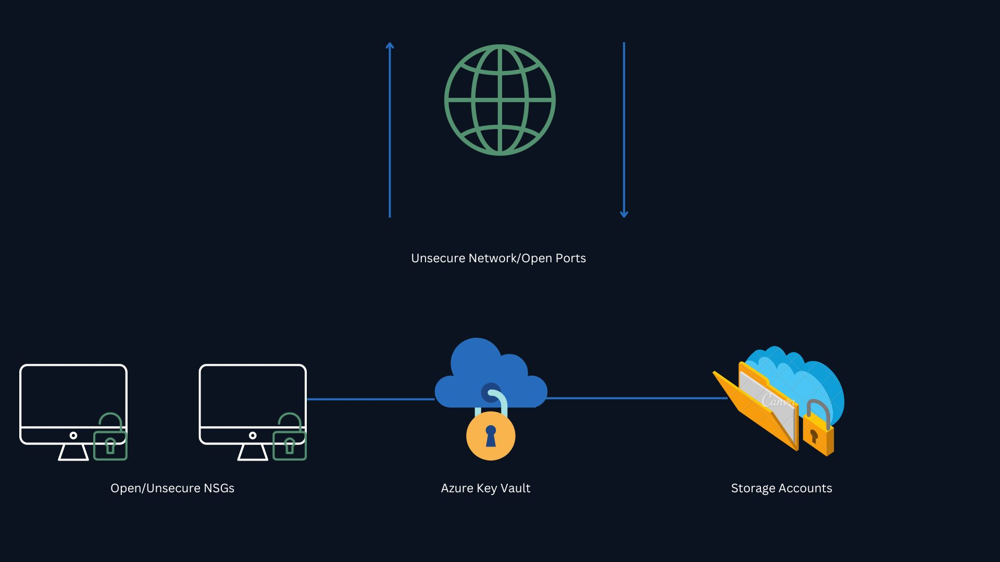
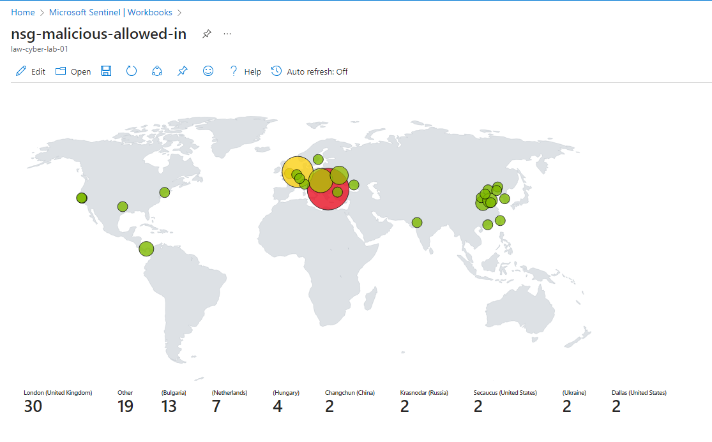
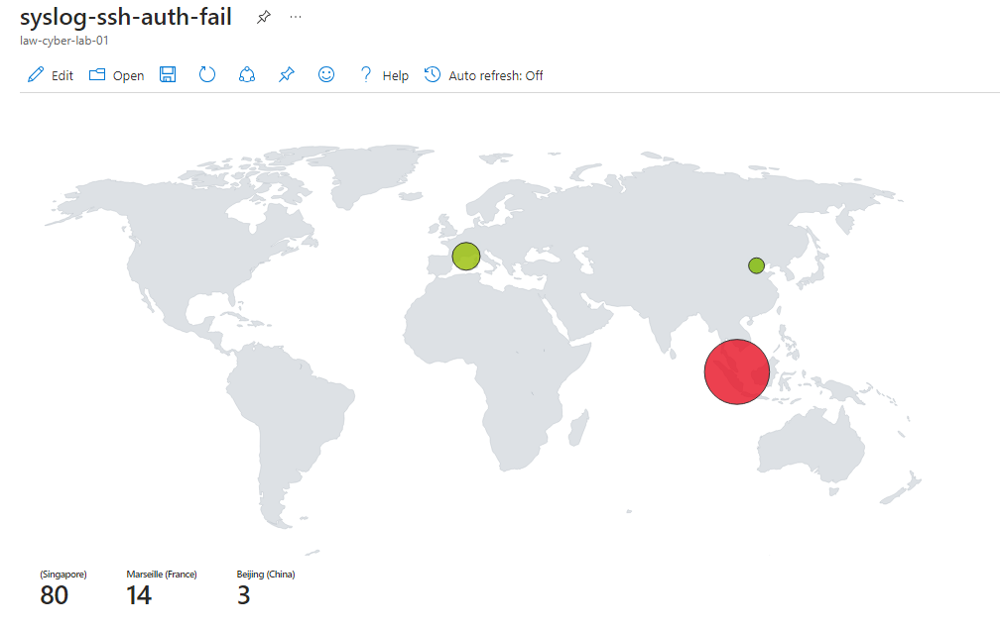
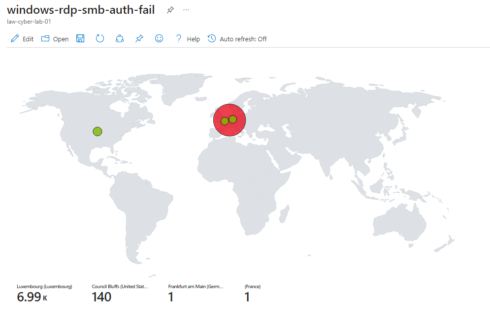

# Azure-SOC

## Purpose and Objectives

the purpose of this project was to construct a SOC environment within Azure. The objective was to capture and analyze logs from several sources, subsequently consolidated within a Log Analytics workspace. Microsoft Sentinel was impleented to analyze these logs by developing attack maps, creating alert triggers, and incident generation. Azure Sentinel measured the metrics of an insecure environment over a 24-hour period. Following this phase, security controls were implemented to fortify the virtual environment. Lastly, another 24-hour metric measurement phase was conducted and the results obtained from these endeavors are presented below. The metrics analyzed were:

- SecurityEvent (Windows Event Logs)
- Syslog (Linux Event Logs)
- SecurityAlert (Log Analytics Alerts Triggered)
- SecurityIncident (Incidents created by Sentinel)
- AzureNetworkAnalytics_CL

# Azure Components Deployed

- Network Security Group (NSG)
- Virtual Machines (2 Windows, 1 Linux)
- Log Analytics Workspace Using (KQL)
- Azure Key Vault
- Azure Storage Account
- Microsoft Sentinel
- Microsoft Defender
- Visual Studio Code

# Azure Evironment Before Hardening / Security Controls

The intial phase of the project consisted of leaving the Azure environment exposed to the internet. The Virtual Machines had both their Network Security Groups and built-in firewalls left wide open, and all other components deployed with public endpoints visible to the Internet. The purpose of this was to attract threat actors and observe their begavioral patterns. I created a Windows virtual machine housed with SQL database, also  a Linux server with both their network security groups set to Allow All settings. This created an unsecured Azure environment with monitoring tool Microsoft Sentinel that used logs aggregated by Logs Analytics workspace.

# Azure Evironment After Hardening / Security Controls

During the Final phase of this project, it consisted of Network Security Groups were hardened by blocking inbound and outbound traffic with the exception of the created public IP addresses that are required access to the virtual machines, and all other resources were protected by their built-in firewalls also Private Endpoint.

# Azure Maps Before Hardening / Security Control

The attack map highlights the criticality of securing your infrastructure. With an open Network Security Group (NSG), malicious traffic flowed freely, emphasizing the need for robust security measures. Implementing restricted NSG rules helps prevent unauthorized access and minimizes potential threats, reinforcing the significance of information security.

# Metrics Before Hardening / Security Controls

In the insecure environment, we conducted a comprehensive measurement of key metrics over a 24-hour period, starting on June 19, 2023, at 11:27PM (EST) and ending on June 20, 2023, at 11:27PM (EST). 

| Metric                   | Count
| ------------------------ | -----
| SecurityEvent            | 19217
| Syslog                   | 6917
| SecurityAlert            | 1
| SecurityIncident         | 218
| NSG Inbound Malicious Flows Allowed | 562

